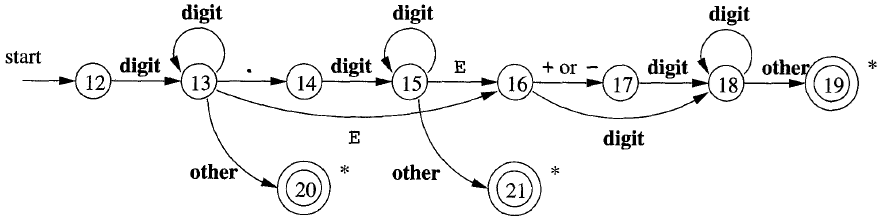

# String to Number 

### Converts a string to float/double using the following transition diagram.



*State Diagram is taken from:* 
Aho AV, Lam MS, Sethi R. 2006. Compilers: 
Principles, Techniques, and Tools (2nd Edition), pp 133, Figure 3.16


&nbsp;

## Requirements
 Requires C++17 or higher.


&nbsp;


## Use


```C++
#include <iostream>
#include "number.h" //single header

#define CONVERT(x, expr, FLOAT) \
	f = tonumber<FLOAT>(x); \
	std::cout << expr << std::endl;

int main()
{
    float f;
	CONVERT("12.3", 2*f, decltype(f));
	CONVERT("1E-5", 2*f, decltype(f));
	CONVERT("1.25E-1", 4*f, decltype(f));
	CONVERT("1.25E1", 4*f, decltype(f));
	CONVERT("1.25E001", 4*f, decltype(f));

	// This will cause error
	try {
		CONVERT("1.E25E001", 4*f, decltype(f));
	} 
	catch (const std::runtime_error& e) {
		std::cout << e.what() << std::endl;
	}
}
```
*Output:*  
24.6  
2e-05  
0.5  
50  
50  
Error in parsing number
